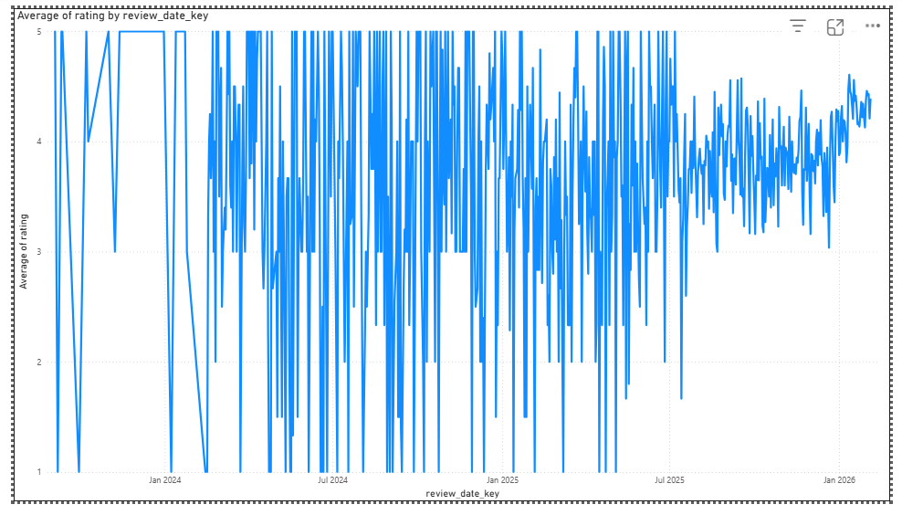

# Lab 2 - Data Pipeline with dbt & DuckDB

A modular analytical data pipeline that ingests Google Play Store data, transforms it into a dimensional star schema using dbt Core, stores it in DuckDB, and serves it to Power BI for visualization.

## Architecture
`
Python (Lab 1)       dbt Core + DuckDB                  Power BI
──────────────  ──────────────────────────────────  ──────────────
apps_catalog.json -> staging -> dimensions -> fact -> dashboards
apps_reviews.json      views      tables      table
                          playstore.duckdb
`

## Project Structure
- models/staging/ — stg_playstore_apps, stg_playstore_reviews (views)
- models/marts/dimensions/ — dim_apps, dim_apps_scd, dim_categories, dim_developers, dim_date (tables)
- models/marts/facts/ — fact_reviews (incremental table)
- snapshots/ — apps_snapshot.sql (SCD Type 2)
- simulate_scd2_change.py — SCD2 simulation script
- Section_C_Data_Modeling.docx — Kimball design document

## Setup
pip install dbt-core dbt-duckdb duckdb
dbt run --full-refresh
dbt test

## Data Model
| Table | Type | Grain |
|---|---|---|
| fact_reviews | Fact (incremental) | One row per user review per app |
| dim_apps_scd | Dimension SCD2 | One row per app version (historical) |
| dim_apps | Dimension current | One row per app |
| dim_categories | Dimension | One row per category |
| dim_developers | Dimension | One row per developer |
| dim_date | Dimension | One row per calendar day |

## Key Features
- Incremental Loading: fact_reviews uses unique_key='review_id' to only process new reviews
- SCD Type 2: apps_snapshot tracks historical changes to category, developer, and rating
- 34 Data Quality Tests: unique, not_null, and referential integrity across all layers

## BI Visualization (Power BI)
Connected directly to playstore.duckdb. Average review rating over time:

## SCD2 Simulation
python simulate_scd2_change.py
dbt snapshot
dbt run
